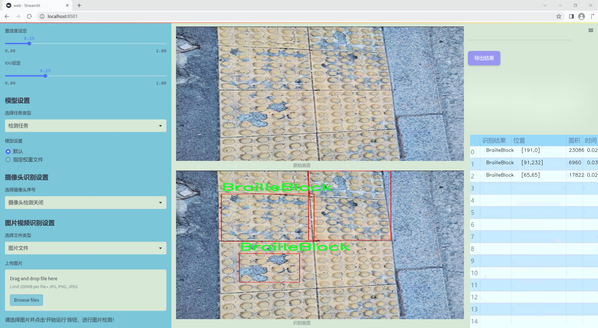
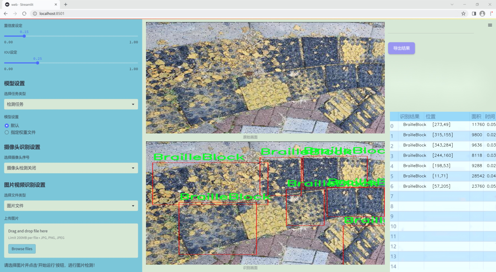
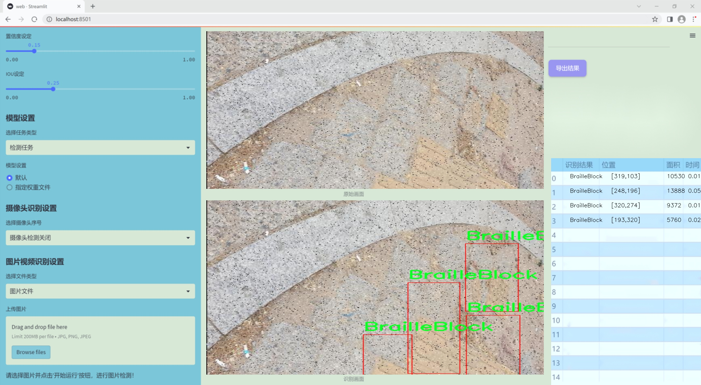
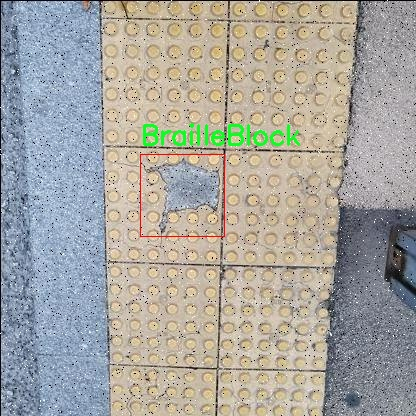
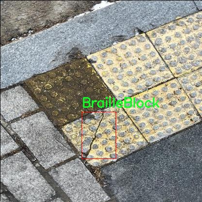
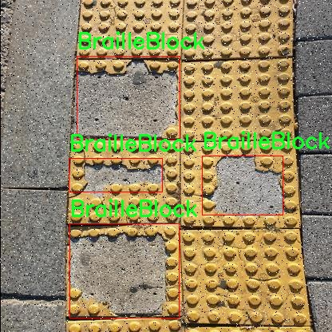
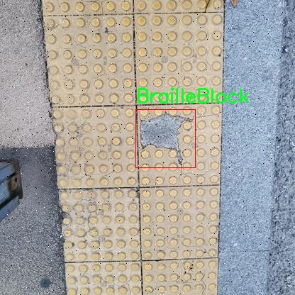
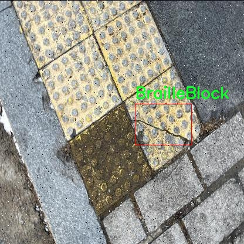

### 1.背景意义

研究背景与意义

随着城市化进程的加快，公共设施的建设和维护显得尤为重要，尤其是针对视障人士的无障碍设施。在众多无障碍设施中，盲道砖块作为重要的导向工具，能够有效帮助视障人士在城市环境中安全行走。然而，盲道砖块在长期使用过程中，容易出现磨损、破损和缺陷，这不仅影响了其功能性，还可能对视障人士的安全造成威胁。因此，及时、准确地检测盲道砖块的缺陷，对于提升城市无障碍环境的安全性和可用性具有重要意义。

传统的盲道砖块缺陷检测方法多依赖人工巡查，效率低下且容易受到主观因素的影响。随着计算机视觉技术的迅猛发展，基于深度学习的自动化检测方法逐渐成为研究热点。YOLO（You Only Look Once）系列算法因其高效的实时检测能力，已被广泛应用于各类目标检测任务中。特别是YOLOv11的改进版本，结合了更先进的特征提取和处理机制，能够在复杂环境中实现更高的检测精度和速度。

本研究旨在基于改进的YOLOv11算法，构建一个盲道砖块缺陷检测系统。该系统将利用包含4198张标注图像的数据集，专注于盲道砖块的缺陷识别。通过对数据集的深入分析和模型的优化训练，期望能够实现对盲道砖块缺陷的自动化检测，提升检测的准确性和效率。这不仅能够为城市无障碍设施的维护提供技术支持，还能为视障人士的安全出行提供保障，推动社会对无障碍环境建设的重视和投入。

### 2.视频效果

[2.1 视频效果](https://www.bilibili.com/video/BV1gQURYqE3h/)

### 3.图片效果







##### [项目涉及的源码数据来源链接](https://kdocs.cn/l/cszuIiCKVNis)**

注意：本项目提供训练的数据集和训练教程,由于版本持续更新,暂不提供权重文件（best.pt）,请按照6.训练教程进行训练后实现上图演示的效果。

### 4.数据集信息

##### 4.1 本项目数据集类别数＆类别名

nc: 1
names: ['BrailleBlock']


该项目为【目标检测】数据集，请在【训练教程和Web端加载模型教程（第三步）】这一步的时候按照【目标检测】部分的教程来训练

##### 4.2 本项目数据集信息介绍

本项目数据集信息介绍

本项目所使用的数据集专注于盲道砖块的缺陷检测，旨在为改进YOLOv11模型提供高质量的训练数据。数据集的主题为“BrailleBlock”，主要涵盖了盲道砖块的各种形态和状态，特别是针对其在实际应用中可能出现的缺陷。该数据集的类别数量为1，具体类别为“BrailleBlock”，这意味着所有的数据样本均围绕这一特定类别展开，确保了数据集的专一性和针对性。

在数据收集过程中，我们通过实地拍摄和图像采集的方式，涵盖了不同环境和光照条件下的盲道砖块图像。这些图像不仅包括完好无损的盲道砖块，还包括因磨损、破损、错位等原因导致的各种缺陷样本。这种多样化的样本选择，旨在提高模型对不同缺陷的识别能力，从而增强其在实际应用中的有效性和可靠性。

数据集中的图像经过精心标注，确保每一张图像都能够准确反映盲道砖块的状态。这一过程不仅涉及到对缺陷的标识，还包括对砖块整体结构的分析，力求为模型提供全面的信息支持。此外，为了提高模型的泛化能力，数据集中还包含了不同角度、不同距离拍摄的图像，使得模型在面对实际场景时能够更好地适应变化。

总之，本项目的数据集为盲道砖块缺陷检测系统的训练提供了坚实的基础，旨在通过改进YOLOv11模型，提升其在实际应用中的表现，最终实现对盲道砖块状态的高效、准确检测。这不仅有助于提升公共设施的安全性，也为盲人出行提供了更为可靠的保障。











### 5.全套项目环境部署视频教程（零基础手把手教学）

[5.1 所需软件PyCharm和Anaconda安装教程（第一步）](https://www.bilibili.com/video/BV1BoC1YCEKi/?spm_id_from=333.999.0.0&vd_source=bc9aec86d164b67a7004b996143742dc)


[5.2 安装Python虚拟环境创建和依赖库安装视频教程（第二步）](https://www.bilibili.com/video/BV1ZoC1YCEBw?spm_id_from=333.788.videopod.sections&vd_source=bc9aec86d164b67a7004b996143742dc)

### 6.改进YOLOv11训练教程和Web_UI前端加载模型教程（零基础手把手教学）

[6.1 改进YOLOv11训练教程和Web_UI前端加载模型教程（第三步）](https://www.bilibili.com/video/BV1BoC1YCEhR?spm_id_from=333.788.videopod.sections&vd_source=bc9aec86d164b67a7004b996143742dc)


按照上面的训练视频教程链接加载项目提供的数据集，运行train.py即可开始训练



     Epoch   gpu_mem       box       obj       cls    labels  img_size
     1/200     20.8G   0.01576   0.01955  0.007536        22      1280: 100%|██████████| 849/849 [14:42<00:00,  1.04s/it]
               Class     Images     Labels          P          R     mAP@.5 mAP@.5:.95: 100%|██████████| 213/213 [01:14<00:00,  2.87it/s]
                 all       3395      17314      0.994      0.957      0.0957      0.0843

     Epoch   gpu_mem       box       obj       cls    labels  img_size
     2/200     20.8G   0.01578   0.01923  0.007006        22      1280: 100%|██████████| 849/849 [14:44<00:00,  1.04s/it]
               Class     Images     Labels          P          R     mAP@.5 mAP@.5:.95: 100%|██████████| 213/213 [01:12<00:00,  2.95it/s]
                 all       3395      17314      0.996      0.956      0.0957      0.0845

     Epoch   gpu_mem       box       obj       cls    labels  img_size
     3/200     20.8G   0.01561    0.0191  0.006895        27      1280: 100%|██████████| 849/849 [10:56<00:00,  1.29it/s]
               Class     Images     Labels          P          R     mAP@.5 mAP@.5:.95: 100%|███████   | 187/213 [00:52<00:00,  4.04it/s]
                 all       3395      17314      0.996      0.957      0.0957      0.0845


###### [项目数据集下载链接](https://kdocs.cn/l/cszuIiCKVNis)

### 7.原始YOLOv11算法讲解


ultralytics发布了最新的作品YOLOv11，这一次YOLOv11的变化相对于ultralytics公司的上一代作品YOLOv8变化不是很大的（YOLOv9、YOLOv10均不是ultralytics公司作品），其中改变的位置涉及到C2f变为C3K2，在SPPF后面加了一层类似于注意力机制的C2PSA，还有一个变化大家从yaml文件是看不出来的就是它的检测头内部替换了两个DWConv，以及模型的深度和宽度参数进行了大幅度调整，但是在损失函数方面就没有变化还是采用的CIoU作为边界框回归损失，下面带大家深入理解一下ultralytics最新作品YOLOv11的创新点。

**下图为最近的YOLO系列发布时间线！**


* * *

###### YOLOv11和YOLOv8对比

在YOLOYOLOv5，YOLOv8，和YOLOv11是ultralytics公司作品（ultralytics出品必属精品），下面用一张图片从yaml文件来带大家对比一下YOLOv8和YOLOv11的区别，配置文件变得内容比较少大家可以看一卡，左侧为YOLOv8右侧为YOLOv11，不同的点我用黑线标注了出来。


* * *

###### YOLOv11的网络结构解析

下面的图片为YOLOv11的网络结构图。


**其中主要创新点可以总结如下- > **

* * *

1\.
提出C3k2机制，其中C3k2有参数为c3k，其中在网络的浅层c3k设置为False（下图中可以看到c3k2第二个参数被设置为False，就是对应的c3k参数）。


此时所谓的C3k2就相当于YOLOv8中的C2f，其网络结构为一致的，其中的C3k机制的网络结构图如下图所示
**（为什么叫C3k2，我个人理解是因为C3k的调用时C3k其中的参数N固定设置为2的原因，个人理解不一定对** ）。


* * *

2\.
第二个创新点是提出C2PSA机制，这是一个C2（C2f的前身）机制内部嵌入了一个多头注意力机制，在这个过程中我还发现作者尝试了C2fPSA机制但是估计效果不如C2PSA，有的时候机制有没有效果理论上真的很难解释通，下图为C2PSA机制的原理图，仔细观察把Attention哪里去掉则C2PSA机制就变为了C2所以我上面说C2PSA就是C2里面嵌入了一个PSA机制。


* * *

3\.
第三个创新点可以说是原先的解耦头中的分类检测头增加了两个DWConv，具体的对比大家可以看下面两个图下面的是YOLOv11的解耦头，上面的是YOLOv8的解耦头.


我们上面看到了在分类检测头中YOLOv11插入了两个DWConv这样的做法可以大幅度减少参数量和计算量（原先两个普通的Conv大家要注意到卷积和是由3变为了1的，这是形成了两个深度可分离Conv），大家可能不太理解为什么加入了两个DWConv还能够减少计算量，以及什么是深度可分离Conv，下面我来解释一下。

> **`DWConv` 代表 Depthwise
> Convolution（深度卷积）**，是一种在卷积神经网络中常用的高效卷积操作。它主要用于减少计算复杂度和参数量，尤其在移动端或轻量化网络（如
> MobileNet）中十分常见。
>
> **1\. 标准卷积的计算过程**
>
> 在标准卷积操作中，对于一个输入张量（通常是一个多通道的特征图），卷积核的尺寸是 `(h, w, C_in)`，其中 `h` 和 `w`
> 是卷积核的空间尺寸，`C_in`
> 是输入通道的数量。而卷积核与输入张量做的是完整的卷积运算，每个输出通道都与所有输入通道相连并参与卷积操作，导致计算量比较大。
>
> 标准卷积的计算过程是这样的：
>
>   * 每个输出通道是所有输入通道的组合（加权求和），卷积核在每个位置都会计算与所有输入通道的点积。
>   * 假设有 `C_in` 个输入通道和 `C_out` 个输出通道，那么卷积核的总参数量是 `C_in * C_out * h * w`。
>

>
> 2\. **Depthwise Convolution（DWConv）**
>
> 与标准卷积不同， **深度卷积** 将输入的每个通道单独处理，即 **每个通道都有自己的卷积核进行卷积**
> ，不与其他通道进行交互。它可以被看作是标准卷积的一部分，专注于空间维度上的卷积运算。
>
> **深度卷积的计算过程：**
>
>   * 假设输入张量有 `C_in` 个通道，每个通道会使用一个 `h × w`
> 的卷积核进行卷积操作。这个过程称为“深度卷积”，因为每个通道独立进行卷积运算。
>   * 输出的通道数与输入通道数一致，每个输出通道只和对应的输入通道进行卷积，没有跨通道的组合。
>   * 参数量和计算量相比标准卷积大大减少，卷积核的参数量是 `C_in * h * w`。
>

>
> **深度卷积的优点：**
>
>   1. **计算效率高** ：相对于标准卷积，深度卷积显著减少了计算量。它只处理空间维度上的卷积，不再处理通道间的卷积。
>   2.  **参数量减少** ：由于每个卷积核只对单个通道进行卷积，参数量大幅减少。例如，标准卷积的参数量为 `C_in * C_out * h *
> w`，而深度卷积的参数量为 `C_in * h * w`。
>   3.  **结合点卷积可提升效果** ：为了弥补深度卷积缺乏跨通道信息整合的问题，通常深度卷积后会配合 `1x1` 的点卷积（Pointwise
> Convolution）使用，通过 `1x1` 的卷积核整合跨通道的信息。这种组合被称为 **深度可分离卷积** （Depthwise
> Separable Convolution） | **这也是我们本文YOLOv11中的做法** 。
>

>
> 3\. **深度卷积与标准卷积的区别**
>
> 操作类型| 卷积核大小| 输入通道数| 输出通道数| 参数量  
> ---|---|---|---|---  
> 标准卷积| `h × w`| `C_in`| `C_out`| `C_in * C_out * h * w`  
> 深度卷积（DWConv）| `h × w`| `C_in`| `C_in`| `C_in * h * w`  
>  
> 可以看出，深度卷积在相同的卷积核大小下，参数量减少了约 `C_out` 倍
> （细心的人可以发现用最新版本的ultralytics仓库运行YOLOv8参数量相比于之前的YOLOv8以及大幅度减少了这就是因为检测头改了的原因但是名字还是Detect，所以如果你想继续用YOLOv8发表论文做实验那么不要更新最近的ultralytics仓库）。
>
> **4\. 深度可分离卷积 (Depthwise Separable Convolution)**
>
> 深度卷积常与 `1x1` 的点卷积配合使用，这称为深度可分离卷积。其过程如下：
>
>   1. 先对输入张量进行深度卷积，对每个通道独立进行空间卷积。
>   2. 然后通过 `1x1` 点卷积，对通道维度进行混合，整合不同通道的信息。
>

>
> 这样既可以保证计算量的减少，又可以保持跨通道的信息流动。
>
> 5\. **总结**
>
> `DWConv` 是一种高效的卷积方式，通过单独处理每个通道来减少计算量，结合 `1x1`
> 的点卷积，形成深度可分离卷积，可以在保持网络性能的同时极大地减少模型的计算复杂度和参数量。

**看到这里大家应该明白了为什么加入了两个DWConv还能减少参数量以及YOLOv11的检测头创新点在哪里。**

* * *

##### YOLOv11和YOLOv8还有一个不同的点就是其各个版本的模型（N - S - M- L - X）网络深度和宽度变了


可以看到在深度（depth）和宽度
（width）两个地方YOLOv8和YOLOv11是基本上完全不同了，这里我理解这么做的含义就是模型网络变小了，所以需要加深一些模型的放缩倍数来弥补模型之前丧失的能力从而来达到一个平衡。

> **本章总结：**
> YOLOv11的改进点其实并不多更多的都是一些小的结构上的创新，相对于之前的YOLOv5到YOLOv8的创新，其实YOLOv11的创新点不算多，但是其是ultralytics公司的出品，同时ultralytics仓库的使用量是非常多的（不像YOLOv9和YOLOv10）所以在未来的很长一段时间内其实YOLO系列估计不会再更新了，YOLOv11作为最新的SOTA肯定是十分适合大家来发表论文和创新的。
>

### 8.200+种全套改进YOLOV11创新点原理讲解

#### 8.1 200+种全套改进YOLOV11创新点原理讲解大全

由于篇幅限制，每个创新点的具体原理讲解就不全部展开，具体见下列网址中的改进模块对应项目的技术原理博客网址【Blog】（创新点均为模块化搭建，原理适配YOLOv5~YOLOv11等各种版本）

[改进模块技术原理博客【Blog】网址链接](https://gitee.com/qunmasj/good)


#### 8.2 精选部分改进YOLOV11创新点原理讲解

###### 这里节选部分改进创新点展开原理讲解(完整的改进原理见上图和[改进模块技术原理博客链接](https://gitee.com/qunmasj/good)【如果此小节的图加载失败可以通过CSDN或者Github搜索该博客的标题访问原始博客，原始博客图片显示正常】
### 全维动态卷积ODConv
鉴于上述讨论，我们的ODConv引入了一种多维注意机制，该机制具有并行策略，用于学习卷积核在核空间的所有四个维度上的不同注意。图提供了CondConv、DyConv和ODConv的示意性比较。

ODConv的公式：根据等式1中的符号，ODConv可定义为


 将注意力标量分配给整个卷积核。图2示出了将这四种类型的关注乘以n个卷积核的过程。原则上，这四种类型的关注是相互补充的，并且以位置、信道、滤波器和核的顺序将它们逐步乘以卷积核 
 ，使得卷积运算不同w.r.t.所有空间位置、所有输入信道、所有滤波器和输入x的所有核，提供捕获丰富上下文线索的性能保证。因此，ODConv可以显著增强CNN基本卷积运算的特征提取能力。此外，具有单个卷积核的ODConv可以与标准CondConv和DyConv竞争或优于它们，为最终模型引入的额外参数大大减少。提供了大量实验来验证这些优点。通过比较等式1和等式2，我们可以清楚地看到，ODConv是一种更广义的动态卷积。此外，当设置n=1且 所有分量均为1时，只关注滤波器方向 的ODConv将减少为：将基于输入特征的SE变量应用于卷积滤波器，然后进行卷积运算（注意原始SE（Hu等人，2018b）基于输出特征，并且用于重新校准输出特征本身）。这种SE变体是ODConv的特例。


图：将ODConv中的四种注意类型逐步乘以卷积核的示例。（a） 沿空间维度的逐位置乘法运算，（b）沿输入信道维度的逐信道乘法运算、（c）沿输出信道维度的按滤波器乘法运算，以及（d）沿卷积核空间的核维度的按核乘法运算。方法部分对符号进行了说明
实现：对于ODConv，一个关键问题是如何计算卷积核的四种关注度 。继CondConv和DyConv之后，我们还使用SE型注意力模块（Hu等人，2018b），但将多个头部作为来计算它们，其结构如图所示。具体而言，首先通过逐通道全局平均池（GAP）运算将输入压缩到具有长度的特征向量中。随后，存在完全连接（FC）层和四个头部分支。ReLU（Krizhevsky等人，2012）位于FC层之后。FC层将压缩特征向量映射到具有缩减比的低维空间（根据消融实验，我们在所有主要实验中设置 ，避免了高模型复杂度）。对于四个头部分支，每个分支都有一个输出大小如图。

### 引入ODConv的改进YOLO
参考这篇博客涵盖了引入ODConv的改进YOLOv11系统的内容，ODConv采用多维注意机制，在卷积核空间的四个维度上学习不同的注意。结合了CondConv和DyConv的优势，ODConv通过图示的四种注意类型逐步与卷积核相乘，以捕获丰富的上下文线索，提升特征提取能力。

#### ODConv结构与方法
ODConv的公式和图示展示了其关注力分配给卷积核的方式，其中四种类型的关注以位置、信道、滤波器和核的顺序逐步与卷积核相乘。这种结构保证了卷积运算不同于标准的Conv操作，能够捕获更多上下文信息，从而增强了CNN的特征提取能力。另外，单个卷积核的ODConv在性能上能够与CondConv和DyConv相竞争，并且引入的额外参数大幅减少。

ODConv的特殊之处在于其广义的动态卷积性质，同时在特定条件下（n=1且所有分量为1），它可以退化为一种特例，即只关注滤波器方向，这类似于基于输入特征的SE变体，但不同于原始SE，它基于输出特征。

#### ODConv的实现
关键问题在于如何计算卷积核的四种关注度。ODConv采用了SE型注意力模块，结合了多个头部来计算这些关注度。具体实现上，通过逐通道全局平均池运算和完全连接层，将输入压缩为特征向量，随后使用四个头部分支来计算四种不同类型的关注。这样的结构能在保持模型复杂度可控的情况下，提升了特征的表征能力。

ODConv的引入为YOLOv11带来了显著的性能提升，并且通过大量实验证明了其在特征提取方面的优越性。其结合了多维注意机制和卷积操作，为目标检测和分拣系统的提升带来了新的思路和性能突破。


### 9.系统功能展示

图9.1.系统支持检测结果表格显示

  图9.2.系统支持置信度和IOU阈值手动调节

  图9.3.系统支持自定义加载权重文件best.pt(需要你通过步骤5中训练获得)

  图9.4.系统支持摄像头实时识别

  图9.5.系统支持图片识别

  图9.6.系统支持视频识别

  图9.7.系统支持识别结果文件自动保存

  图9.8.系统支持Excel导出检测结果数据


### 10. YOLOv11核心改进源码讲解

#### 10.1 fadc.py

以下是对代码中最核心部分的提炼和详细中文注释：

```python
import torch
import torch.nn as nn
import torch.nn.functional as F

class OmniAttention(nn.Module):
    def __init__(self, in_planes, out_planes, kernel_size, groups=1, reduction=0.0625, kernel_num=4, min_channel=16):
        super(OmniAttention, self).__init__()
        # 计算注意力通道数
        attention_channel = max(int(in_planes * reduction), min_channel)
        self.kernel_size = kernel_size
        self.kernel_num = kernel_num
        self.temperature = 1.0  # 温度参数用于控制注意力的平滑程度

        # 定义网络结构
        self.avgpool = nn.AdaptiveAvgPool2d(1)  # 自适应平均池化
        self.fc = nn.Conv2d(in_planes, attention_channel, 1, bias=False)  # 全连接层
        self.bn = nn.BatchNorm2d(attention_channel)  # 批归一化
        self.relu = nn.ReLU(inplace=True)  # ReLU激活函数

        # 通道注意力
        self.channel_fc = nn.Conv2d(attention_channel, in_planes, 1, bias=True)
        self.func_channel = self.get_channel_attention

        # 过滤器注意力
        if in_planes == groups and in_planes == out_planes:  # 深度可分离卷积
            self.func_filter = self.skip
        else:
            self.filter_fc = nn.Conv2d(attention_channel, out_planes, 1, bias=True)
            self.func_filter = self.get_filter_attention

        # 空间注意力
        if kernel_size == 1:  # 点卷积
            self.func_spatial = self.skip
        else:
            self.spatial_fc = nn.Conv2d(attention_channel, kernel_size * kernel_size, 1, bias=True)
            self.func_spatial = self.get_spatial_attention

        # 核心注意力
        if kernel_num == 1:
            self.func_kernel = self.skip
        else:
            self.kernel_fc = nn.Conv2d(attention_channel, kernel_num, 1, bias=True)
            self.func_kernel = self.get_kernel_attention

        self._initialize_weights()  # 初始化权重

    def _initialize_weights(self):
        # 权重初始化
        for m in self.modules():
            if isinstance(m, nn.Conv2d):
                nn.init.kaiming_normal_(m.weight, mode='fan_out', nonlinearity='relu')
                if m.bias is not None:
                    nn.init.constant_(m.bias, 0)
            if isinstance(m, nn.BatchNorm2d):
                nn.init.constant_(m.weight, 1)
                nn.init.constant_(m.bias, 0)

    @staticmethod
    def skip(_):
        return 1.0  # 跳过操作，返回1.0

    def get_channel_attention(self, x):
        # 计算通道注意力
        channel_attention = torch.sigmoid(self.channel_fc(x).view(x.size(0), -1, 1, 1) / self.temperature)
        return channel_attention

    def get_filter_attention(self, x):
        # 计算过滤器注意力
        filter_attention = torch.sigmoid(self.filter_fc(x).view(x.size(0), -1, 1, 1) / self.temperature)
        return filter_attention

    def get_spatial_attention(self, x):
        # 计算空间注意力
        spatial_attention = self.spatial_fc(x).view(x.size(0), 1, 1, 1, self.kernel_size, self.kernel_size)
        spatial_attention = torch.sigmoid(spatial_attention / self.temperature)
        return spatial_attention

    def get_kernel_attention(self, x):
        # 计算核心注意力
        kernel_attention = self.kernel_fc(x).view(x.size(0), -1, 1, 1, 1, 1)
        kernel_attention = F.softmax(kernel_attention / self.temperature, dim=1)
        return kernel_attention

    def forward(self, x):
        # 前向传播
        x = self.avgpool(x)  # 自适应平均池化
        x = self.fc(x)  # 全连接层
        x = self.bn(x)  # 批归一化
        x = self.relu(x)  # ReLU激活
        return self.func_channel(x), self.func_filter(x), self.func_spatial(x), self.func_kernel(x)

class AdaptiveDilatedConv(nn.Module):
    """自适应膨胀卷积的封装，作为普通卷积层的替代。"""
    
    def __init__(self, in_channels, out_channels, kernel_size, stride=1, padding=0, dilation=1, groups=1, bias=True):
        super(AdaptiveDilatedConv, self).__init__()
        self.conv = nn.Conv2d(in_channels, out_channels, kernel_size, stride=stride, padding=padding, dilation=dilation, groups=groups, bias=bias)
        self.omni_attention = OmniAttention(in_channels, out_channels, kernel_size)  # 添加OmniAttention

    def forward(self, x):
        # 前向传播
        attention_outputs = self.omni_attention(x)  # 计算注意力
        x = self.conv(x)  # 卷积操作
        # 可以根据需要将注意力输出与卷积输出结合
        return x * attention_outputs[0]  # 以通道注意力为例

# 其他类和函数可以根据需要进行类似的提炼和注释
```

以上代码保留了最核心的部分，主要包括`OmniAttention`类和`AdaptiveDilatedConv`类，并对每个方法进行了详细的中文注释。

这个 `fadc.py` 文件实现了一些用于深度学习的自定义卷积层和注意力机制，主要基于 PyTorch 框架。代码中包含多个类和函数，下面是对这些内容的逐一分析和说明。

首先，文件中引入了必要的库，包括 `torch` 和 `torch.nn`，并尝试从 `mmcv` 中导入一些模块化的可变形卷积操作。如果导入失败，则使用普通的 `nn.Module` 作为替代。

接下来，定义了一个名为 `OmniAttention` 的类。这个类实现了一种全局注意力机制，主要用于在卷积神经网络中增强特征的表达能力。构造函数中，首先计算出注意力通道的数量，并定义了一系列的卷积层和激活函数。注意力机制分为通道注意力、过滤器注意力、空间注意力和核注意力，分别通过不同的卷积层实现。`forward` 方法中，输入特征经过一系列处理后，返回四种不同的注意力权重。

然后，定义了一个函数 `generate_laplacian_pyramid`，用于生成拉普拉斯金字塔。该函数通过逐层下采样输入张量，并计算每层的拉普拉斯差分，返回金字塔结构的特征图。这个过程对于多尺度特征提取非常有用。

接下来是 `FrequencySelection` 类，它实现了一种频率选择机制。这个类通过不同的卷积层和池化操作来选择特定频率的特征。构造函数中，定义了频率选择的参数，并根据选择的模式（如平均池化、拉普拉斯或频率）初始化相应的层。`forward` 方法中，根据输入特征和注意力特征计算输出。

`AdaptiveDilatedConv` 类是一个自适应扩张卷积的实现，继承自 `ModulatedDeformConv2d`。这个类允许使用可变形卷积，同时结合了之前定义的注意力机制。构造函数中，设置了卷积的参数和注意力机制。`forward` 方法中，处理输入特征并应用可变形卷积，最终返回处理后的特征图。

最后，`AdaptiveDilatedDWConv` 类是一个扩展的版本，专门用于深度可分离卷积，允许在卷积操作中使用注意力机制和频率选择。这个类的实现与 `AdaptiveDilatedConv` 类似，但增加了对深度可分离卷积的支持。

整体来看，这个文件实现了一种复杂的卷积操作和注意力机制组合，适用于需要高效特征提取和处理的深度学习任务，尤其是在计算机视觉领域。通过使用自适应卷积和频率选择，可以提高模型的性能和灵活性。

#### 10.2 test_selective_scan_easy.py

以下是代码中最核心的部分，并附上详细的中文注释：

```python
import torch
import torch.nn.functional as F

def selective_scan_easy(us, dts, As, Bs, Cs, Ds, delta_bias=None, delta_softplus=False, return_last_state=False, chunksize=64):
    """
    选择性扫描函数
    参数说明：
    us: 输入张量，形状为 (B, G * D, L)
    dts: 时间增量张量，形状为 (B, G * D, L)
    As: 系数矩阵，形状为 (G * D, N)
    Bs: 系数矩阵，形状为 (B, G, N, L)
    Cs: 系数矩阵，形状为 (B, G, N, L)
    Ds: 偏置项，形状为 (G * D)
    delta_bias: 可选的偏置调整项
    delta_softplus: 是否对 dts 应用 softplus 激活函数
    return_last_state: 是否返回最后的状态
    chunksize: 每次处理的序列长度
    """
    
    def selective_scan_chunk(us, dts, As, Bs, Cs, hprefix):
        """
        处理一个数据块的选择性扫描
        参数说明：
        us: 输入张量的一个块
        dts: 时间增量张量的一个块
        As, Bs, Cs: 系数矩阵
        hprefix: 前一个状态
        返回值：
        ys: 输出张量
        hs: 状态张量
        """
        ts = dts.cumsum(dim=0)  # 计算时间增量的累积和
        Ats = torch.einsum("gdn,lbgd->lbgdn", As, ts).exp()  # 计算指数矩阵
        scale = 1  # 归一化因子
        rAts = Ats / scale  # 归一化后的 A 矩阵
        duts = dts * us  # 计算 duts
        dtBus = torch.einsum("lbgd,lbgn->lbgdn", duts, Bs)  # 计算 dtBus
        hs_tmp = rAts * (dtBus / rAts).cumsum(dim=0)  # 计算临时状态
        hs = hs_tmp + Ats * hprefix.unsqueeze(0)  # 计算当前状态
        ys = torch.einsum("lbgn,lbgdn->lbgd", Cs, hs)  # 计算输出
        return ys, hs

    # 数据类型设置
    dtype = torch.float32
    inp_dtype = us.dtype  # 输入数据类型
    has_D = Ds is not None  # 检查 Ds 是否存在
    if chunksize < 1:
        chunksize = Bs.shape[-1]  # 设置 chunksize

    # 处理 delta_bias 和 delta_softplus
    dts = dts.to(dtype)
    if delta_bias is not None:
        dts = dts + delta_bias.view(1, -1, 1).to(dtype)
    if delta_softplus:
        dts = F.softplus(dts)

    # 处理输入数据的形状
    Bs = Bs.unsqueeze(1) if len(Bs.shape) == 3 else Bs
    Cs = Cs.unsqueeze(1) if len(Cs.shape) == 3 else Cs
    B, G, N, L = Bs.shape
    us = us.view(B, G, -1, L).permute(3, 0, 1, 2).to(dtype)
    dts = dts.view(B, G, -1, L).permute(3, 0, 1, 2).to(dtype)
    As = As.view(G, -1, N).to(dtype)
    Bs = Bs.permute(3, 0, 1, 2).to(dtype)
    Cs = Cs.permute(3, 0, 1, 2).to(dtype)
    Ds = Ds.view(G, -1).to(dtype) if has_D else None
    D = As.shape[1]  # 状态维度

    oys = []  # 输出列表
    hprefix = us.new_zeros((B, G, D, N), dtype=dtype)  # 初始化前一个状态
    for i in range(0, L, chunksize):
        ys, hs = selective_scan_chunk(
            us[i:i + chunksize], dts[i:i + chunksize], 
            As, Bs[i:i + chunksize], Cs[i:i + chunksize], hprefix, 
        )
        oys.append(ys)  # 添加输出
        hprefix = hs[-1]  # 更新前一个状态

    oys = torch.cat(oys, dim=0)  # 合并输出
    if has_D:
        oys = oys + Ds * us  # 添加偏置项
    oys = oys.permute(1, 2, 3, 0).view(B, -1, L)  # 调整输出形状

    return oys.to(inp_dtype) if not return_last_state else (oys.to(inp_dtype), hprefix.view(B, G * D, N).float())
```

### 代码核心部分说明：
1. **函数定义**：`selective_scan_easy` 是核心函数，负责处理输入数据并返回经过选择性扫描后的输出。
2. **数据块处理**：内部函数 `selective_scan_chunk` 处理输入数据的一个块，计算当前状态和输出。
3. **时间增量的累积和**：使用 `cumsum` 计算时间增量的累积和。
4. **指数计算**：通过 `torch.einsum` 计算指数矩阵和其他中间结果。
5. **输出和状态更新**：将计算得到的输出和状态更新到列表中，最后合并输出。

### 其他注意事项：
- 代码中涉及到的张量操作（如 `einsum`、`permute`、`view` 等）是 PyTorch 中常用的高效操作。
- `delta_bias` 和 `delta_softplus` 是可选参数，用于调整时间增量的计算。
- `return_last_state` 参数决定是否返回最后的状态信息。

这个程序文件 `test_selective_scan_easy.py` 主要实现了一个选择性扫描（Selective Scan）算法的功能，并通过单元测试来验证其正确性。选择性扫描是一种在序列数据上进行动态计算的技术，常用于处理时间序列或序列模型中的状态更新。

文件的开头部分包含了一些版权信息和导入的库，包括 `torch`、`pytest` 和 `einops` 等。接下来定义了一个名为 `selective_scan_easy` 的函数，它的主要功能是对输入的序列数据进行选择性扫描计算。该函数的输入参数包括多个张量（tensor），如 `us`、`dts`、`As`、`Bs`、`Cs` 和 `Ds`，这些参数分别代表不同的状态和权重信息。

在 `selective_scan_easy` 函数内部，首先定义了一个名为 `selective_scan_chunk` 的嵌套函数，用于处理数据的分块计算。这个函数通过对输入数据进行累加和变换，计算出每个时间步的输出和状态。然后，主函数会根据给定的 `chunksize` 参数将输入数据分块处理，并将每个块的结果进行合并。

该函数还支持一些额外的功能，如对输入数据进行偏置调整和应用 softplus 激活函数。最终，函数返回计算结果，用户可以选择是否返回最后的状态。

接下来定义了一个 `SelectiveScanEasy` 类，它继承自 `torch.autograd.Function`，用于实现自定义的前向和反向传播。这个类的 `forward` 方法实现了选择性扫描的前向计算，而 `backward` 方法则实现了反向传播，计算梯度信息。

在文件的后半部分，定义了一些辅助函数和测试函数，包括 `selective_scan_easy_fwdbwd` 和 `selective_scan_ref`，后者用于与参考实现进行比较，以验证选择性扫描的正确性。文件中还使用了 `pytest` 框架来进行单元测试，测试函数 `test_selective_scan` 使用多种参数组合来验证选择性扫描的功能和性能。

最后，文件提供了一个命令行接口，允许用户直接运行测试函数，确保实现的正确性和有效性。整体而言，这个程序文件是一个复杂的深度学习模型中的一部分，主要用于高效地处理序列数据。

#### 10.3 EfficientFormerV2.py

以下是经过简化和注释的核心代码部分，保留了 EfficientFormerV2 模型的主要结构和功能：

```python
import torch
import torch.nn as nn
import math
import itertools

class Attention4D(nn.Module):
    def __init__(self, dim=384, key_dim=32, num_heads=8, attn_ratio=4, resolution=7, act_layer=nn.ReLU, stride=None):
        super().__init__()
        self.num_heads = num_heads  # 注意力头的数量
        self.scale = key_dim ** -0.5  # 缩放因子
        self.key_dim = key_dim  # 键的维度
        self.d = int(attn_ratio * key_dim)  # 注意力的维度
        self.dh = self.d * num_heads  # 总的注意力维度

        # 处理输入的分辨率和步幅
        if stride is not None:
            self.resolution = math.ceil(resolution / stride)
            self.stride_conv = nn.Conv2d(dim, dim, kernel_size=3, stride=stride, padding=1, groups=dim)
            self.upsample = nn.Upsample(scale_factor=stride, mode='bilinear')
        else:
            self.resolution = resolution
            self.stride_conv = None
            self.upsample = None

        # 定义查询、键、值的卷积层
        self.q = nn.Conv2d(dim, num_heads * key_dim, 1)
        self.k = nn.Conv2d(dim, num_heads * key_dim, 1)
        self.v = nn.Conv2d(dim, num_heads * self.d, 1)

        # 注意力偏置
        points = list(itertools.product(range(self.resolution), repeat=2))
        attention_offsets = {}
        idxs = []
        for p1 in points:
            for p2 in points:
                offset = (abs(p1[0] - p2[0]), abs(p1[1] - p2[1]))
                if offset not in attention_offsets:
                    attention_offsets[offset] = len(attention_offsets)
                idxs.append(attention_offsets[offset])
        self.attention_biases = nn.Parameter(torch.zeros(num_heads, len(attention_offsets)))
        self.register_buffer('attention_bias_idxs', torch.LongTensor(idxs).view(len(points), len(points)))

    def forward(self, x):
        B, C, H, W = x.shape  # 获取输入的形状
        if self.stride_conv is not None:
            x = self.stride_conv(x)  # 进行步幅卷积

        # 计算查询、键、值
        q = self.q(x).flatten(2).reshape(B, self.num_heads, -1, self.resolution).permute(0, 1, 3, 2)
        k = self.k(x).flatten(2).reshape(B, self.num_heads, -1, self.resolution).permute(0, 1, 2, 3)
        v = self.v(x).flatten(2).reshape(B, self.num_heads, -1, self.resolution).permute(0, 1, 3, 2)

        # 计算注意力权重
        attn = (q @ k) * self.scale + self.attention_biases[:, self.attention_bias_idxs]
        attn = attn.softmax(dim=-1)  # 归一化

        # 计算输出
        x = (attn @ v).transpose(2, 3).reshape(B, self.dh, self.resolution, self.resolution)
        if self.upsample is not None:
            x = self.upsample(x)  # 上采样

        return x

class EfficientFormerV2(nn.Module):
    def __init__(self, layers, embed_dims, num_classes=1000):
        super().__init__()
        self.patch_embed = nn.Conv2d(3, embed_dims[0], kernel_size=3, stride=2, padding=1)  # 初始嵌入层
        self.network = nn.ModuleList()  # 存储网络的各个层

        # 构建网络的各个阶段
        for i in range(len(layers)):
            stage = []
            for _ in range(layers[i]):
                stage.append(Attention4D(dim=embed_dims[i]))  # 添加注意力层
            self.network.append(nn.Sequential(*stage))  # 将阶段添加到网络中

        self.classifier = nn.Linear(embed_dims[-1], num_classes)  # 分类器

    def forward(self, x):
        x = self.patch_embed(x)  # 嵌入输入
        for block in self.network:
            x = block(x)  # 通过网络的每个阶段
        x = x.mean(dim=[2, 3])  # 全局平均池化
        x = self.classifier(x)  # 分类
        return x

# 定义模型的实例
def efficientformerv2_s0(num_classes=1000):
    model = EfficientFormerV2(
        layers=[2, 2, 4, 2],  # 各层的深度
        embed_dims=[32, 64, 128, 256],  # 各层的嵌入维度
        num_classes=num_classes
    )
    return model

# 测试模型
if __name__ == '__main__':
    inputs = torch.randn((1, 3, 640, 640))  # 输入示例
    model = efficientformerv2_s0()  # 创建模型
    res = model(inputs)  # 前向传播
    print(res.size())  # 输出结果的形状
```

### 代码说明：
1. **Attention4D 类**：实现了一个四维注意力机制，包括查询、键、值的计算，以及注意力权重的归一化和输出的计算。
2. **EfficientFormerV2 类**：构建了整个 EfficientFormerV2 模型，包含了嵌入层和多个注意力层，最后通过全局平均池化和线性层进行分类。
3. **efficientformerv2_s0 函数**：用于创建一个特定配置的 EfficientFormerV2 模型实例。
4. **主程序**：测试模型的前向传播，输出结果的形状。

这个程序文件实现了一个名为 `EfficientFormerV2` 的深度学习模型，主要用于图像处理任务。模型的设计灵感来源于视觉变换器（Vision Transformer），并在此基础上进行了优化，以提高计算效率和性能。

首先，文件中定义了一些模型的超参数，包括不同规模（S0, S1, S2, L）的宽度和深度。这些参数以字典的形式存储，方便后续模型的构建。每种规模对应不同的网络层数和通道数，以适应不同的应用场景和计算资源。

接下来，文件中定义了多个类，分别实现了模型的不同组件。其中 `Attention4D` 类实现了一个四维注意力机制，支持多头注意力和可选的下采样功能。这个类通过卷积层来生成查询（Q）、键（K）和值（V），并计算注意力权重。它还实现了局部注意力机制，以增强模型对局部特征的捕捉能力。

`Embedding` 类负责将输入图像转换为嵌入特征，使用卷积层进行特征提取。根据是否使用轻量级或自适应下采样的策略，`Embedding` 类的实现有所不同。

`Mlp` 类实现了多层感知机（MLP），使用1x1卷积进行特征转换，并包含激活函数和归一化层。`AttnFFN` 和 `FFN` 类则分别实现了结合注意力机制和MLP的前馈网络。

`eformer_block` 函数用于构建模型的各个块，根据给定的层数和参数配置生成相应的网络结构。`EfficientFormerV2` 类是整个模型的核心，负责整合各个组件并定义前向传播逻辑。该类的构造函数中根据输入的层数和通道数构建网络，并在需要时添加归一化层。

文件的最后部分定义了几个函数，用于创建不同规模的 `EfficientFormerV2` 模型，并支持加载预训练权重。`update_weight` 函数用于更新模型的权重，确保加载的权重与模型结构匹配。

在 `__main__` 部分，程序通过随机生成的输入张量测试了不同规模的模型，并打印出每个模型输出的特征图尺寸。这部分代码可以用于验证模型的构建是否正确。

总体来说，这个程序文件展示了如何构建一个高效的视觉变换器模型，涵盖了从基本组件到整体架构的设计思路，并提供了灵活的接口以适应不同的应用需求。

#### 10.4 RFAConv.py

以下是代码中最核心的部分，并附上详细的中文注释：

```python
import torch
import torch.nn as nn
from einops import rearrange

class RFAConv(nn.Module):
    def __init__(self, in_channel, out_channel, kernel_size, stride=1):
        super().__init__()
        self.kernel_size = kernel_size

        # 用于生成权重的网络
        self.get_weight = nn.Sequential(
            nn.AvgPool2d(kernel_size=kernel_size, padding=kernel_size // 2, stride=stride),
            nn.Conv2d(in_channel, in_channel * (kernel_size ** 2), kernel_size=1, groups=in_channel, bias=False)
        )
        
        # 用于生成特征的网络
        self.generate_feature = nn.Sequential(
            nn.Conv2d(in_channel, in_channel * (kernel_size ** 2), kernel_size=kernel_size, padding=kernel_size // 2, stride=stride, groups=in_channel, bias=False),
            nn.BatchNorm2d(in_channel * (kernel_size ** 2)),
            nn.ReLU()
        )
        
        # 最终的卷积层
        self.conv = nn.Conv2d(in_channel, out_channel, kernel_size=kernel_size, stride=kernel_size)

    def forward(self, x):
        b, c = x.shape[0:2]  # 获取输入的批量大小和通道数
        weight = self.get_weight(x)  # 计算权重
        h, w = weight.shape[2:]  # 获取特征图的高度和宽度
        
        # 计算权重的softmax
        weighted = weight.view(b, c, self.kernel_size ** 2, h, w).softmax(2)  # b c*k**2, h, w
        feature = self.generate_feature(x).view(b, c, self.kernel_size ** 2, h, w)  # b c*k**2, h, w
        
        # 加权特征
        weighted_data = feature * weighted
        
        # 重排数据以适应卷积层的输入格式
        conv_data = rearrange(weighted_data, 'b c (n1 n2) h w -> b c (h n1) (w n2)', n1=self.kernel_size, n2=self.kernel_size)
        
        return self.conv(conv_data)  # 返回卷积结果


class SE(nn.Module):
    def __init__(self, in_channel, ratio=16):
        super(SE, self).__init__()
        self.gap = nn.AdaptiveAvgPool2d((1, 1))  # 全局平均池化
        self.fc = nn.Sequential(
            nn.Linear(in_channel, ratio, bias=False),  # 从 c -> c/r
            nn.ReLU(),
            nn.Linear(ratio, in_channel, bias=False),  # 从 c/r -> c
            nn.Sigmoid()
        )

    def forward(self, x):
        b, c = x.shape[0:2]  # 获取输入的批量大小和通道数
        y = self.gap(x).view(b, c)  # 进行全局平均池化并调整形状
        y = self.fc(y).view(b, c, 1, 1)  # 通过全连接层并调整形状
        return y  # 返回通道注意力权重


class RFCBAMConv(nn.Module):
    def __init__(self, in_channel, out_channel, kernel_size=3, stride=1):
        super().__init__()
        self.kernel_size = kernel_size
        
        # 特征生成网络
        self.generate = nn.Sequential(
            nn.Conv2d(in_channel, in_channel * (kernel_size ** 2), kernel_size, padding=kernel_size // 2, stride=stride, groups=in_channel, bias=False),
            nn.BatchNorm2d(in_channel * (kernel_size ** 2)),
            nn.ReLU()
        )
        
        # 权重生成网络
        self.get_weight = nn.Sequential(nn.Conv2d(2, 1, kernel_size=3, padding=1, bias=False), nn.Sigmoid())
        self.se = SE(in_channel)  # 通道注意力模块

        # 最终的卷积层
        self.conv = nn.Conv2d(in_channel, out_channel, kernel_size=kernel_size, stride=kernel_size)

    def forward(self, x):
        b, c = x.shape[0:2]  # 获取输入的批量大小和通道数
        channel_attention = self.se(x)  # 计算通道注意力
        generate_feature = self.generate(x)  # 生成特征

        h, w = generate_feature.shape[2:]  # 获取特征图的高度和宽度
        generate_feature = generate_feature.view(b, c, self.kernel_size ** 2, h, w)  # 调整形状
        
        # 重排数据以适应卷积层的输入格式
        generate_feature = rearrange(generate_feature, 'b c (n1 n2) h w -> b c (h n1) (w n2)', n1=self.kernel_size, n2=self.kernel_size)
        
        # 计算加权特征
        unfold_feature = generate_feature * channel_attention
        
        # 计算最大值和均值特征
        max_feature, _ = torch.max(generate_feature, dim=1, keepdim=True)
        mean_feature = torch.mean(generate_feature, dim=1, keepdim=True)
        
        # 计算感受野注意力
        receptive_field_attention = self.get_weight(torch.cat((max_feature, mean_feature), dim=1))
        
        # 返回卷积结果
        conv_data = unfold_feature * receptive_field_attention
        return self.conv(conv_data)
```

### 代码说明：
1. **RFAConv**：实现了一种加权特征生成的卷积层，首先通过平均池化和卷积生成权重，然后生成特征，最后将加权特征输入到卷积层中。
2. **SE**：实现了通道注意力机制，通过全局平均池化和全连接层生成通道权重，用于增强重要特征的表达。
3. **RFCBAMConv**：结合了特征生成、通道注意力和感受野注意力的卷积层，旨在提升特征提取的能力。

以上是核心代码的精简与注释，主要集中在特征生成、权重计算和注意力机制的实现上。

这个程序文件 `RFAConv.py` 定义了一些用于卷积神经网络的模块，主要包括自定义的激活函数、卷积层以及结合注意力机制的卷积层。文件中包含多个类，每个类都实现了特定的功能。

首先，文件导入了必要的库，包括 PyTorch 和 einops。接着定义了两个自定义的激活函数类：`h_sigmoid` 和 `h_swish`。`h_sigmoid` 是一种激活函数，使用了 ReLU6 作为基础，输入加上 3 后进行归一化处理。`h_swish` 则是将输入与 `h_sigmoid` 的输出相乘，形成一种新的激活方式。

接下来是 `RFAConv` 类，它实现了一种特殊的卷积操作。该类的构造函数中定义了几个层，包括一个用于获取权重的平均池化层和卷积层，以及一个用于生成特征的卷积层。`forward` 方法中，输入数据经过权重计算和特征生成后，进行加权处理，并最终通过卷积层输出结果。

`SE` 类实现了 Squeeze-and-Excitation（SE）模块，通过全局平均池化和全连接层来生成通道注意力权重。该模块可以增强网络对重要特征的关注。

`RFCBAMConv` 类是一个结合了通道注意力和特征生成的卷积模块。它在构造函数中定义了特征生成层、权重获取层和 SE 模块。在 `forward` 方法中，首先计算通道注意力，然后生成特征并进行加权，最后通过卷积层输出结果。

最后，`RFCAConv` 类是一个结合了空间注意力机制的卷积模块。它的构造函数中同样定义了特征生成层和卷积层，并且通过自适应平均池化计算空间注意力。在 `forward` 方法中，生成特征后进行空间注意力的计算，最后将加权后的特征通过卷积层输出。

整体来看，这个文件实现了一些现代卷积神经网络中常用的结构，结合了注意力机制以提高特征提取的能力，适用于各种计算机视觉任务。

### 11.完整训练+Web前端界面+200+种全套创新点源码、数据集获取


# [下载链接：https://mbd.pub/o/bread/Z5iZmZtt](https://mbd.pub/o/bread/Z5iZmZtt)